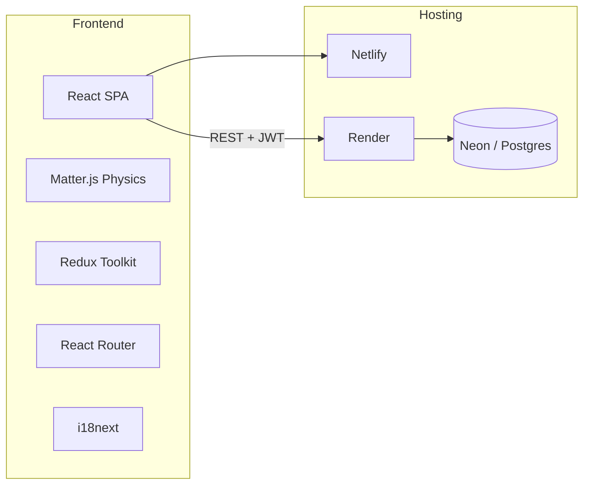
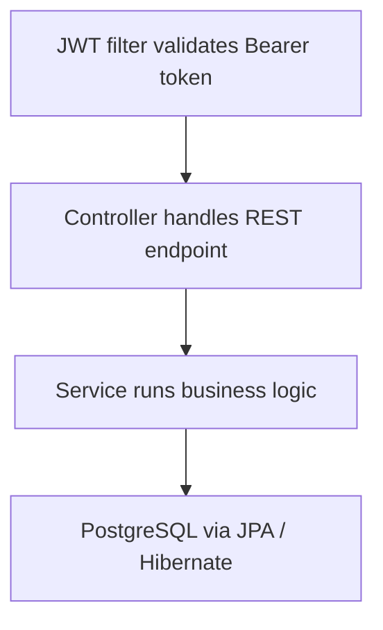
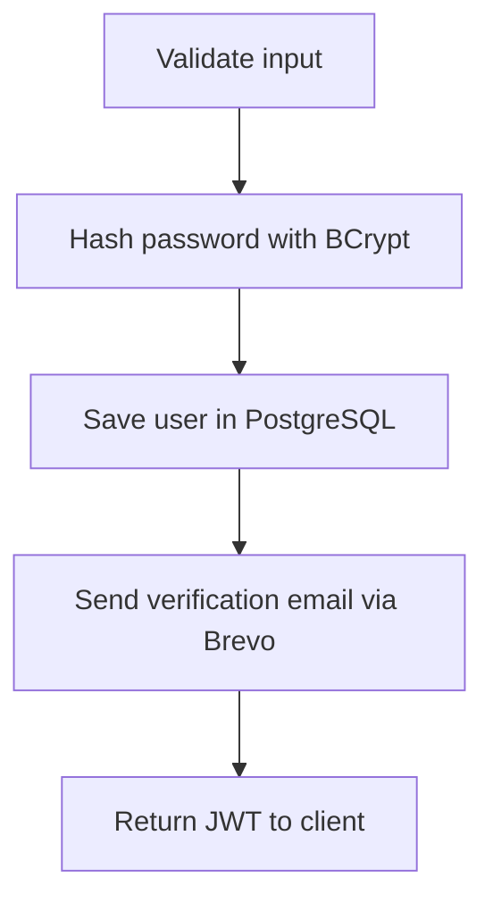
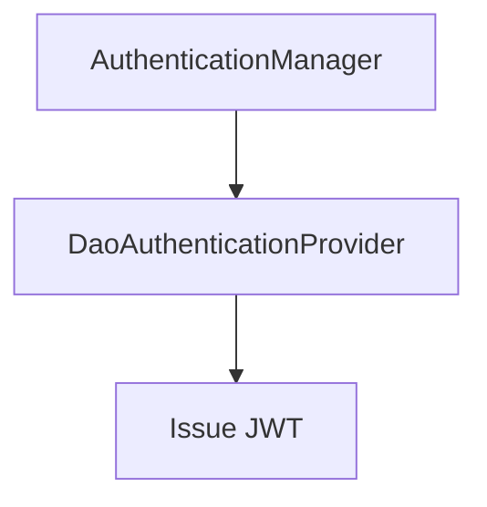
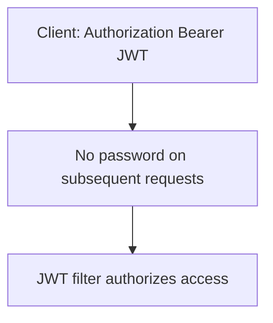

# Technology Stack

Overview of the technologies used in the Merge Fruit project. The app is split across two repositories:

| Repository | Role |
|------------|------|
| [**merge-fruit**](https://github.com/a1exymoroz/merge-fruit) (this repo) | React frontend — game UI, physics, auth client |
| [**merge-fruit-api**](https://github.com/a1exymoroz/merge-fruit-api) | Spring Boot backend — auth, scores, email verification |

## Architecture

## Frontend (`merge-fruit`)

| Layer | Technology |
|-------|------------|
| Language | TypeScript 5 |
| UI framework | React 18 |
| Build tool | Vite 5 |
| Routing | React Router 7 |
| State management | Redux Toolkit + React Redux |
| Physics engine | Matter.js (2D collisions, gravity, merging) |
| Internationalization | i18next + react-i18next (EN, PL, RU) |
| Styling | Plain CSS (component-scoped `.css` files) |
| Auth (client) | React Context (`AuthContext`) + `localStorage` for JWT |
| API client | Native `fetch` |
| E2E testing | Playwright (Chromium, Firefox, WebKit) |
| Formatting | Prettier |
| Deployment | Netlify (SPA redirects via `netlify.toml` + `public/_redirects`) |

### Key directories

| Path | Purpose |
|------|---------|
| `src/hooks/useGamePhysics.ts` | Matter.js game loop and physics |
| `src/components/containers/MergeFruitGame.tsx` | Main game container |
| `src/contexts/AuthContext.tsx` | Auth state and session handling |
| `src/services/` | `authApi.ts`, `leaderboardApi.ts` |
| `src/store/` | Redux slices (`scoresSlice`, `gameSlice`) |
| `src/i18n/` | Translations and language switching |
| `e2e/` | Playwright end-to-end tests |

## Backend (`merge-fruit-api`)

| Layer | Tech |
|-------|------|
| Runtime | Java 21, Maven, Spring Boot 3.4.5 |
| API | Spring Web (REST/JSON), Jakarta Validation |
| Security | Spring Security 6, BCrypt, JWT (JJWT 0.12.6 / HS256) |
| Data | PostgreSQL, Spring Data JPA, Hibernate, HikariCP, Flyway |
| Email | Brevo REST API via RestClient |
| Ops | Spring Actuator, Docker (local), Render + Neon (prod) |

### Request flows

#### Typical authenticated request

#### Signup

#### Login

#### Protected requests

### API endpoints

| Method | Path | Description |
|--------|------|-------------|
| `POST` | `/api/auth/signup` | Register a new user |
| `POST` | `/api/auth/login` | Sign in, returns JWT |
| `GET` | `/api/auth/verify` | Verify email with token + code |
| `GET` | `/api/scores` | Fetch leaderboard (authenticated) |
| `POST` | `/api/scores` | Submit a score (authenticated) |

## Infrastructure & environments

| Environment | Frontend | Backend API |
|-------------|----------|-------------|
| Local | `http://localhost:5173` (Vite) | `http://localhost:8080` |
| Production | Netlify | `https://merge-fruit-api.onrender.com` |

Configuration is driven by `VITE_API_BASE_URL` in `.env.development` and `.env.production`.

## Feature map

| Feature | Stack area |
|---------|------------|
| Fruit physics & merging | Matter.js in `useGamePhysics`, rendered via `Fruit` / `GameContainer` |
| Sign up / login | `AuthContext` + `authApi` → Spring Security + JWT |
| Email verification | `VerifyEmailPage` → Brevo via backend |
| Leaderboard & high score | Redux `scoresSlice` + `leaderboardApi` → PostgreSQL |
| Route protection | `ProtectedRoute` / `GuestRoute` with React Router |
| Multi-language UI | i18next with EN, PL, RU locale files |

## In-app page

The stack is also available in the running app at `/stack`, linked from every page via a floating **Tech Stack** button.
